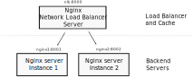

Setting up Nginx as Network Load Balancer Server + Cache.

> In practical situations, the content on the `nginx1` and `nginx2` (i.e. `website-replica1` and `website-replica2` dirs) will be same for the same application. We mount separate volumes just to make it apparent when the content is served from `nginx1` (`website-replica1`) and when from `nginx2` (`website-replica2`)

**Note:** in all containers, after you edit `/etc/nginx/nginx.conf`, stop and restart the container. For some strange reason.  reloading the server (`docker container exec -it nlb nginx -s reload`) doesn't actually update `nginx.conf` although this file is mounted in volume. So just restart the whole container in order the changes to take effect
